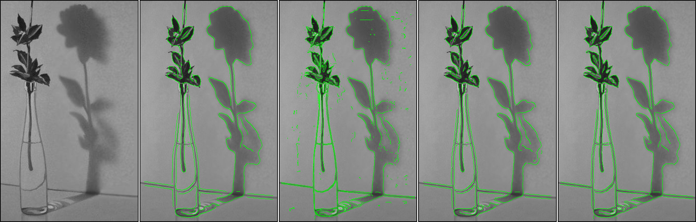
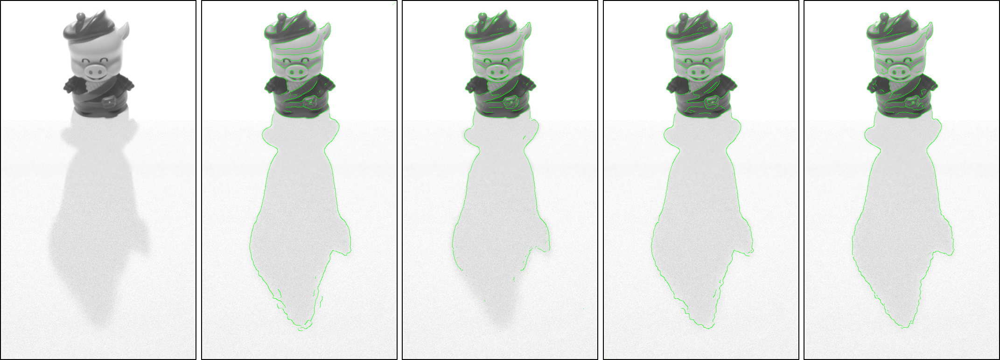
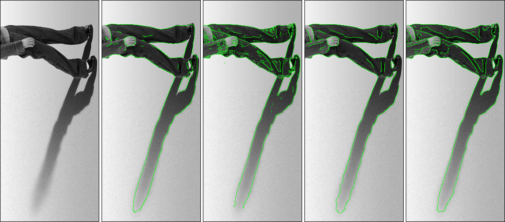
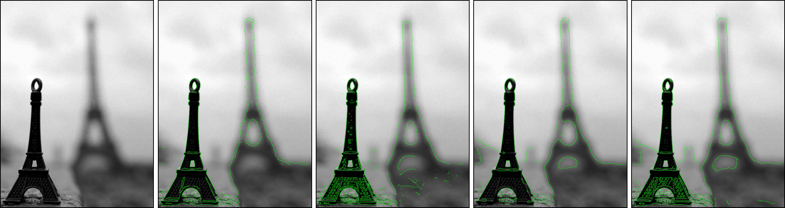
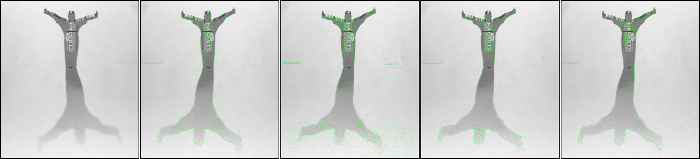
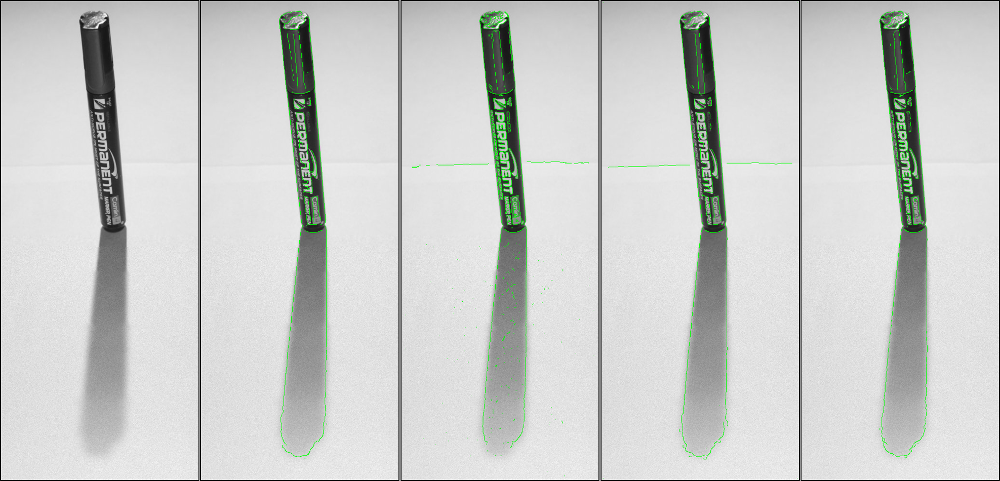
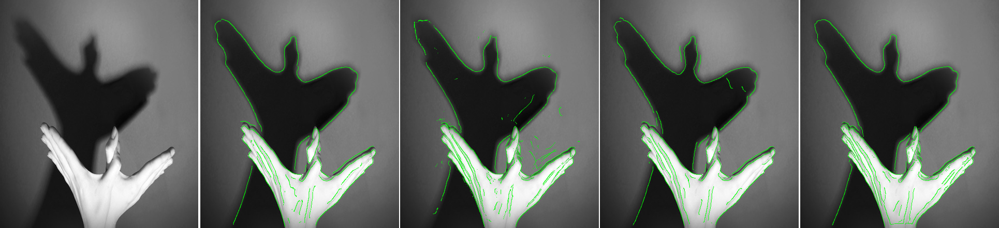

# A Model-Independent Method for Local Blur Estimation and its Application to Edge Detection

Qualitative comparison of edge detection results, from few real world images, obtained using a novel blur-scale based method and two other state-of-the-art algorithms. Each Frame shows a grayscale image, edge detection results from the same image using Canny's algorithm, Elder and Zucker's original method , revised Elder and Zucker's algorithm implemented in matlab, and the proposed blur-scale based algorithm in the same order.

### Example 1

### Example 2

### Example 3

### Example 4

### Example 5

### Example 6

### Example 7

### Example 8
