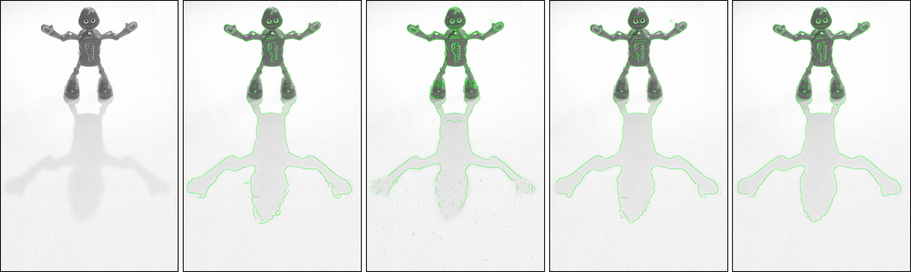

# Blur-Scale-Based-Edge-Detection
A Model-Independent Method for Local Blur Estimation and its Application to Edge Detection

Please take a look at the edge detection results on some real world images. Each Frame shows a grayscale image, edge detection results from the same image using Canny's algorithm, Elder and Zucker's original method , revised Elder and Zucker's algorithm implemented in matlab, and the proposed blur-scale based algorithm in the same order.

## Example 1

